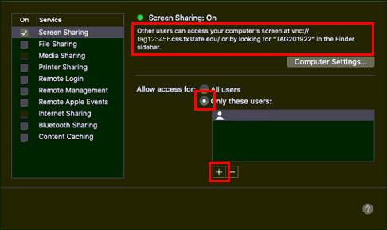
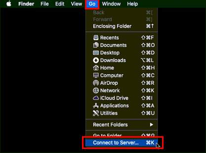
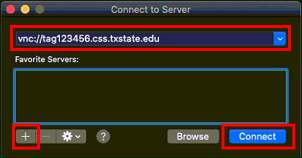

# Screen sharing between Macs on campus and Mac to Mac remote access

**note:**
- OIT has systems in place for connecting to Windows machines remotely (from a Mac or Windows machine), see: https://unr.teamdynamix.com/TDClient/2684/Portal/KB/?CategoryID=19597
- the following instructions are for Mac to Mac connections (not Mac to PC, that is done through OIT, see above)
- if remote, off-campus access is needed between two macs, the user will need to first request VPN access through OIT: https://unr.teamdynamix.com/TDClient/2684/Portal/KB/?CategoryID=19598&SIDs=8600
- VPN access allows for SSH and SFTP to the on campus Mac, but it does not provide VNC access, which is what we will set up below: 

---

## For the on campus Mac:

**You will need the Mac that is on campus connected to a physical ethernet cord, not wifi.**

1. From Apple menu, click System Preferences.
2. Click the Sharing icon.

3. Check the option Screen Sharing. To the right of the Screen Sharing text, the status icon should now be green status.
    - Note the address of the computer listed in the text in the status area. It will be something  like vnc://172.20.195.86
    - In the Allow access for section, select All users or switch to Only these users and click the + button to add the users.

## On the other Mac:

**If accessing from off campus, connect to the VPN.** (if accessing from on campus, can connect to Eduroam with wifi, doesn't need to be physical connection)

1. From the top menu bar, select the Go menu and Connect to Server.

2. Enter the address of the office Mac computer to be accessed remotely using vnc:// as the prefix as in: Example: vnc://172.20.195.86
    - You can click the + plus button to save the connection.

3. Click Connect.
4. Enter an account name and password for the remote Mac to login and use it.

---

**Some other details that might need to be configured include:**
- power settings so that the on campus machine does not go to sleep
- we might need to set a static IP for your work machine so that it does not get a new IP from DHCP if rebooted
